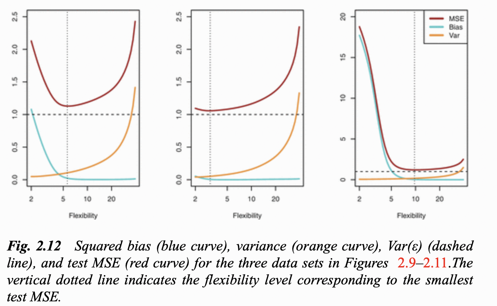
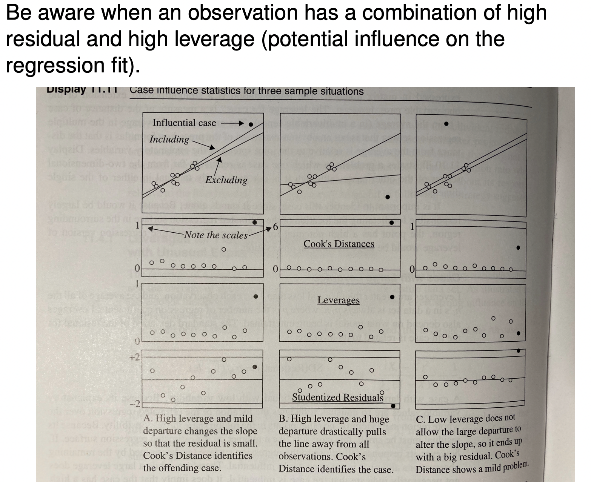
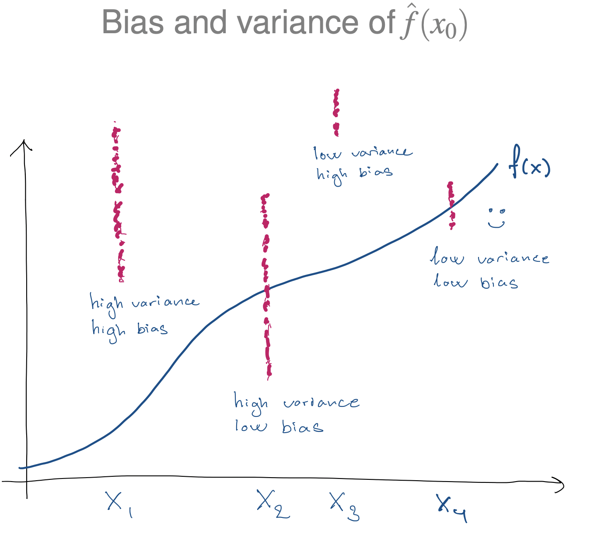
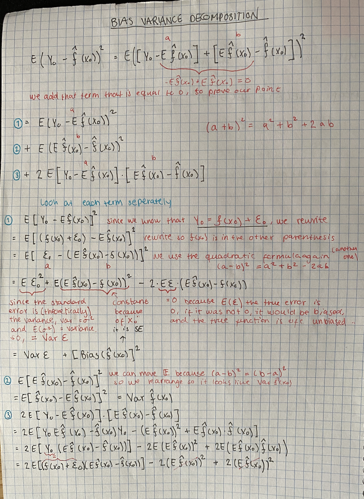
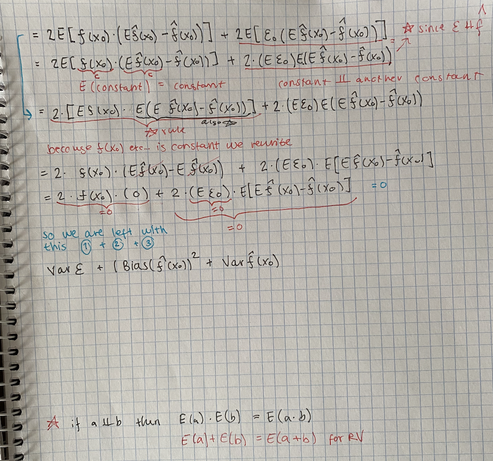

# Lecture 3

Contents: Bias-Var trade off, F-test, reducible+irreducible error, Bias-Var Decomposition

## 2.2.2 The Bias-Variance Trade-Off

Good test set performance of a statistical learning method requires low variance as well as low squared bias. This is referred to as a trade-off because it is easy to obtain a method with extremely low bias but high variance (for instance, by drawing a curve that passes through every single training observation) or a method with very low variance but high bias (by fitting a horizontal line to the data). The challenge lies in finding a method for which both the variance and the squared bias are low. This trade-off is one of the most important recurring themes in this book.

$$
E\left(Y_0-\hat f(x_0)\right)^2 = \underbrace{E\left(\hat f(x_0)-E\hat f(x_0)\right)^2 + \left( E\hat f(x_0)- f(x_0) \right )^2}_\text{Reducible Error} + \underbrace{Var(\epsilon)}_\text{Irreducible Error}
$$

### Reducible & Irreducible Error

All three terms are non-negative, so if any is large, the MSE is
large. 

The **reducible error** can be lowered by using an estimator $\hat f$ that has both low variance and low bias. 

The **irreducible error** is a lower bound on the accuracy of our prediction for Y. (The bound would typically be unknown.)

Dummy Variable???

How well the model fits the data.

AIC??? Akaike I C

BIC (Bayesian Information Criteria)

### Explanation of figures in bias-variance trade off

In the figure to the left, the bias initially decreases rapidly, resulting in an initial sharp decrease in the expected test Mean Squared Error. 

Though in the middle figure, the true $f$ is close to linear, so there is only a small decrease in bias as flexibility increases, and the test MSE inly declines slightly before increasing rapidly as the variance increases. 

In the right figure, as the flexibility increases, there is a dramatic decline in bias because the true $f$ is very non-linear. There is also very little increase in variance as flexibility increases. The test MSE though, declines before the small increases. 

This is **the bias variance trade-off.** The challenge here is finding a method for which both the variance and the squared bias are low.

## F-test

The F-test statistic measures how much the RSS changes (Residual sum of squares) when we use the simpler model instead of the more complex one.

$$
F = \frac{(RSS_{M_0}-RSS_{M_1})/q}{RSS_{M_1}/(n-p-1)}
$$

Nested models can be compared by the F-test

Any set of models can be compared by an information criterion. eg. AIC or BIC.

### Strategies for model selection

- Forward selection (start by including no/few variables)
- Backward (start by including all/many variables)
- Alternating between forwards and backward selection

The residuals should be Gaussian and evenly spread from the fitted line.

## Influential Points

## Bias-Variance Decomposition

consider a model where $Y=f(X) + \epsilon$

Then, the expected MSE at a point $x_0$ can be decomposed as:

$$
E\left(Y_0-\hat f(x_0)\right)^2 = \underbrace{E\left(\hat f(x_0)-E\hat f(x_0)\right)^2}_\text{Variance of $\hat f(x_0)$} + \left( \underbrace{E\hat f(x_0)- f(x_0) }_\text{Bias of $\hat f(x_0)$} \right )^2 + Var(\epsilon)
$$

A very important part of machine learning is models selection. And a tool for model selection is the **********************************************************Bias-Variance Decomposition.********************************************************** 

The ******BVD****** says in a nutshell that the $MSE= \text{bias}^2+Var$.

The MSE of an estimator $\hat\theta$ for some parameter $\theta$ is:

$MSE(\hat \theta)=E((\hat\theta - \theta)^2 | \theta)$ , so simply just the mean of the squared error.

The definition of the bias of an estimator is:

$bias(\hat\theta)= E(\hat \theta)-\theta$

So the bias-var decomposition is a property that says:

$MSE(\hat\theta) = bias(\hat \theta)^2 + var(\hat\theta)$

### Explanation on the proof

We want to minimise $E(Y_0-\hat f(x_0))^2$  (the loss function, MSE in linear regression terms). When you use OLS, you want to minimise the MSE, that is the definition of OLS.

In this proof, we show that MSE can be decomposed into bias and variance of the estimator, which shows that minimisation of the loss function has a trade off between minimising bias and variance. Because it ends with bias^2 + variance, you can see that it is a trade off.

