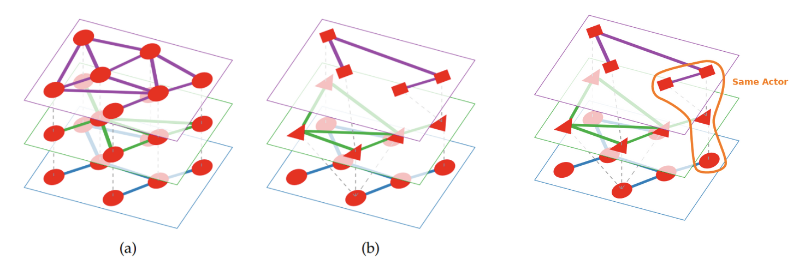
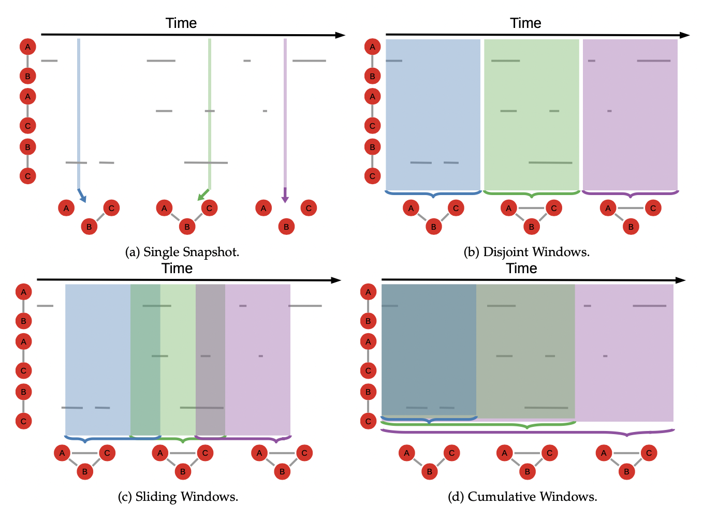
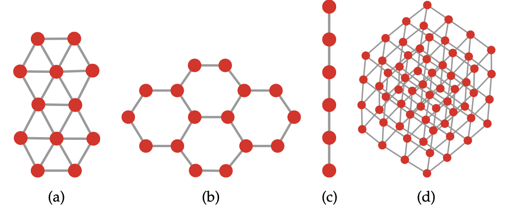

<!-- 
 -->

#### Table of contents

- [3 Basic Graphs](#3-basic-graphs)
- [Extended Graphs](#extended-graphs)
  - [Bipartite graphs](#bipartite-graphs)
  - [Multilayer Graphs](#multilayer-graphs)
    - [One-to-one](#one-to-one)
    - [Many-to-many](#many-to-many)
    - [Interlayer coupling](#interlayer-coupling)
    - [Signed Networks](#signed-networks)
    - [Positive and Negative Relationships](#positive-and-negative-relationships)
  - [Hypergraphs](#hypergraphs)
  - [Dynamic Graphs](#dynamic-graphs)
  - [Network Types](#network-types)
    - [Simple Networks](#simple-networks)
    - [Complex Networks](#complex-networks)
    - [An Example of the Bayesian Network](#an-example-of-the-bayesian-network)
    - [Neural Networks](#neural-networks)
  - [Summary of Chapter 4](#summary-of-chapter-4)

# 3 Basic Graphs

Edge weights can be interpreted in two opposite ways, depending on what the network is representing. They can be considered the *proximity* between the two nodes or their *distance*.

To sum up, “**proximity**” means that a high weight makes the nodes closer together; e.g. they interact a lot, the edge has a high capacity. “**Distance**” means that a high weight makes the nodes further apart; e.g. it’s harder or costly to make the nodes interact.

**Network back-boning**
And, since every pair of nodes have a similarity (because any two vectors can be correlated, minus extremely rare degenerate cases), every node is connected to every other node. So, when working with similarity networks, you will have to filter your connections somehow, a process we call “network back-boning” which is far less trivial that it might sound.

# Extended Graphs

## Bipartite graphs

Bipartite networks are networks in which nodes must be part of wither of two classes ($V_1$ and $V_2$) and edges can only be established between nodes of unlike type. 

Formally we write $G=(V_1,V_2,E)$, and that $E$ can only contain edges like $(v_1,v_2)$. Has to be from each class.

**Examples of bipartite networks could be:**
Connecting countries to the products they export, users to the social media items they tag, bank-firm relation ships in financial networks etc.

Multilayer networks also consist of *nodes and edges*, but the nodes exist in separate *layers*, representing different forms of interactions, which connect to form an *aspect*. **Aspects**, or stacks of layers, can be used to represent different types of contacts, spatial locations, subsystems, or points in time. The edges between nodes in the same layer of an aspect are called ***intralayer connections***, whereas edges between nodes in different layers are *interlayer connections.*

Bipartite networks are only defined for *qualitative* attributes, *not quantitative.*

## Multilayer Graphs

### One-to-one

Sometimes also called **multiplex networks**. 

$$
G=(V,E,L)
$$

Where $V$ and $E$ are sets of nodes and edges and $L$ are sets of layers. Like a class label, qualitative. $(u,v,l,w)$ if weights are added.

There are two ways to represent multilayer networks. The simpler is to use a multigraph. In practice, every edge type – or label – represents a different layer
of the network.

However, in this case, we can add a “type” to each connection, making them qualitatively different: one edge type for Facebook, one for Twitter, one for LinkedIn.

This strategy rests on the assumption that there is a one-to-one node mapping between the layers of the network. 

### Many-to-many

Sometimes called “networks of networks”, because each layer can be seen as a distinct network, and the interlayer couplings are relationships between different networks.

$$
G=(V,E,L,C)
$$

Sometimes a node in one layer can map to multiple nodes – or none! – in another layer. **“interlayer coupling”**: In this scenario, the node is split
into the different layers to which it belongs.

The inter-layer edges run between layers, and their function is to establish that the two nodes in the different layers are really the same node: they are coupled to - or dependent on - each other.

### Interlayer coupling

To fix the insufficient power of multiplex networks to represent true multilayer systems we need to extend the model. In this scenario the node is split into the different layers to which it belongs. 

(Example your identity includes multiple personas: you are the union of the “Facebook you”, the “LinkedIn you”, the “Twitter you”.)

Dashed grey lines represent the inter-layer coupling connections.

Above is a visual representation of this model: each layer is a slice of the network. There are two types of edges: 

The **intra-layer connections** – the traditional type: we’re friends on Facebook, Linkedin, Twitter –, and the inter-layer connections. 

The **inter-layer edges** run between layers, and their function is to establish that the two nodes in the different layers are really the same node: they are *coupled* to – or *dependent* on – each other.
We can now have nodes in one layer expressing coupling with multiple nodes in other layers. In our social media case, we are now allowing you to have multiple profiles in one plat- form that still map on your single profile in another. For instance, you can run as many different Twitter accounts as you want, and they are still coupled with your Facebook account. To get a visual sense on what this means, just like the picture below:

**The actor:** 

In practice, the actor is a connected component, when only considering inter-layer couplings as the possible edges. If my three Twitter profiles all refer to the same person, with maybe two Flickr accounts and one Facebook profile, all these identities belong to the same actor: me.

### Signed Networks

Signed networks are not necessarily restricted to either a single positive or a single negative relationship – e.g. “I trust this person” or “I don’t trust this person”. For instance, in an online game, you can have multiple positive relationships like being friend or trading together; and multiple reasons to have a negative relationship, like fighting each other, or putting a bounty on each other heads.

### Positive and Negative Relationships

Positive and negative relationships have different dynamics. There is a limit to the number of people you can be friends with, but there is no limit to the number of people that can be mad at you. 

## Hypergraphs

A collection of hyper-edges is a hyper-graph. There are some cases in which connections bind together multiple people at the same time. For example a group project. The same relationship connects you with all of them. When er allow the same edge to connect more than two nodes we hall it a hyper-edge.

To make them more manageable, we can put constraints to hyper-edges. We could force them to always contain the same number of nodes. In a soccer tournament, the hyper-edge representing a team can only have eleven members: not one more nor one less, be- cause that’s the number of players in the team. In this case, we call the resulting structure a “uniform hyper-graph”, and have all sorts of interesting properties. In general, when simply talking about hyper-graphs we have no such constraint.

There are two main strategies to **simplify hyper-graphs**. The first is to transform the hyper-edge into the simple edges it stands for.

The second strategy is to turn the hyper-graph into a bipartite network.

## Dynamic Graphs

$$
G=(G_1,G_2,...,G_n) \\ G_i(V_i, E_i) \ \ i=\text{i'th time snapshot }
$$

Most networks can change. For example nodes are people and edges are when they interact with each other through a day. That changes through time. 

To deal with dynamic information when we want to create a static view of the network, you can use 4 standard techniques:

- **Single snapshot** - This is the simplest technique. You choose a moment in time and your graph is simply the collection of nodes and edges active at that precise instant. This strategy works well when the edges in your network are “on” by default. It risks creating an empty network when edges are ephemeral and/or there are long lulls in the connection patterns, for instance in telecommunication networks at night.
- **Disjoint Windows** - Similar to single snapshot. Here we allow longer periods of time to accumulate information. Differently from the previous technique, no information is discarded: when a window ends, the next one begins immediately. Works well when it’s not important to maintain continuity.
- **Sliding Windows** - Similar to disjoint windows, with the difference that we allow the observation periods to overlap. That is, the next window starts before the previous one ended. Works well when it is important to maintain continuity.
- **Cumulative Windows** - Similar to sliding windows, but here we fix the beginning of each window at the beginning of the observation period. Information can only accumulate: we never discard edge information, no matter how long ago it was firstly generated. Each window includes the information of all
    
    
    

## Network Types

### Simple Networks

A simple network is a network we can fully describe analytically. You can have a simple formula that tells you everything you need to know about it. That is not possible in complex networks. 

The difference between a complex and a simple network is the same as the difference between a human being and a sphere (kugle). You can fully describe the shape of a sphere with a few formulas. But describing the shape of a human being is not as easy. 

Here we see simple networks as lattices (grids) to the right. There are other simple networks out there. Lattices can be very useful as a starting point of many advanced tasks. They are the basics of our understanding of epidemic spread in society.  

Other than that, there are simple networks such as the lollipop graph, the wheel graph and many more. 

### Complex Networks

You can divide complex networks into two categories: **Complex networks with fundamental metadata** and **Complex networks without fundamental metadata.** The difference between the two types is that, if the metadata are fundamental, they change the way you interpret some or all the metadata themselves.

For instance, some networks (social networks, biological networks etc) have different meta data attached to their nodes and edges. However, at a fundamental level, the algorithms and the analyses you would have to perform on them are the same, regardless of what the networks represent. 

That is not the case for networks with fundamental metadata. In this case you need to be aware of what the metadata represent, because they change the way you perform the analysis and you interpret the results. 

### An Example of the Bayesian Network

In the classical example, you might have three variables: the probability of raining, the probability of having the sprinklers on, and the probability that the grass is wet. Clearly, rain and sprinklers both might cause the grass to be wet, so the two variables point to them. Rain also might influence the sprinklers, because the automatic system to save water will not turn them on when it’s raining, since it would be pointless. Obviously, the fact that the sprinklers are on will have no effect on whether it will rain or not.

### Neural Networks

The way that they work is that the weight on each node of the output layer is the answer the model is giving. See more page 65

    

## Summary of Chapter 4

- Bipartite networks are networks with two node types. Edges can only connect two nodes of different types. You can generalise them to be *n*-partite, and have *n* node types.
- In multi-graphs we allow to have multiple (parallel) edges between nodes. We can have labeled multi-graphs when we attach labels to nodes and edges. Labels on nodes can be qualitative or quantitative attributes.
- If we only allow one edge with a given label between nodes we have a multiplex or multilayer network: the edge label informs us about the layer in which the edge appears.
- Multilayer networks are networks in which different nodes can connect in different ways. To track which node is “the same” across layers we use inter-layer couplings. Couplings can connect a node in a layer to multiple nodes in another, making a many-to-many correspondence.
- Signed networks are a special type of multilayer network with two layers: one positive (e.g. friendship) and one negative (e.g. enmity).
- Hyper-graphs are graphs whose (hyper)edges can connect more than two nodes at the same time. You can consider hyper-edges as cliques, bipartite edges, or simplicial complexes.
- Dynamic graphs are graphs containing temporal information on nodes and edges. This information tells you when the node/edge was present in the network. There are many ways to aggregate this information to create snapshots of your evolving system.
- Simple networks are networks whose topology can be fully de- scribed with simple rules. For instance, in regular lattices you place nodes uniformly in a space and you connect them with their nearest neighbours.