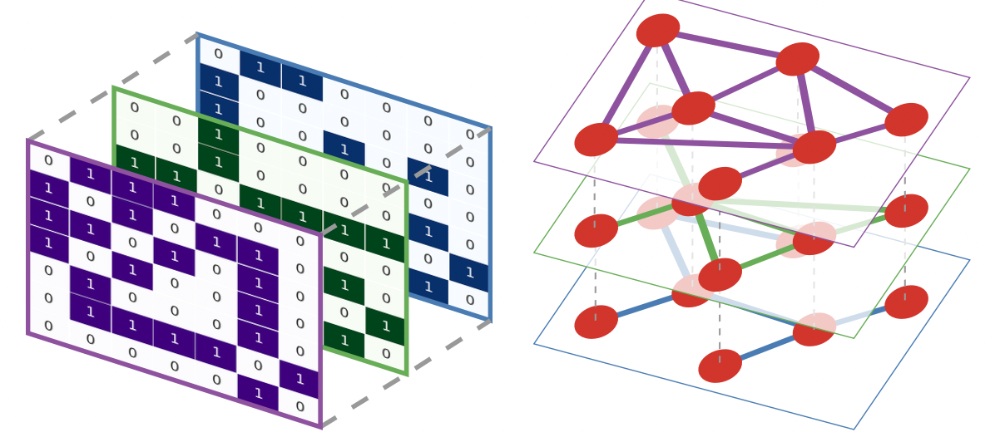
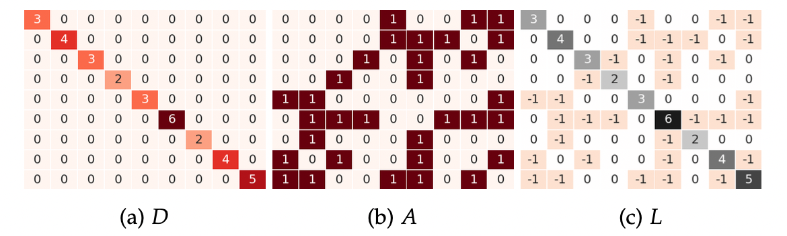
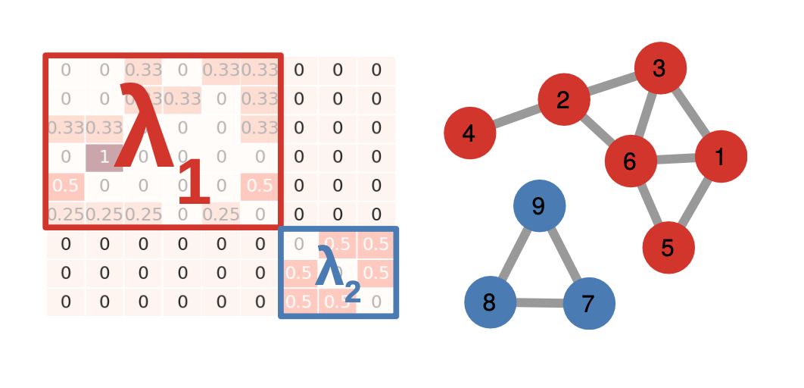
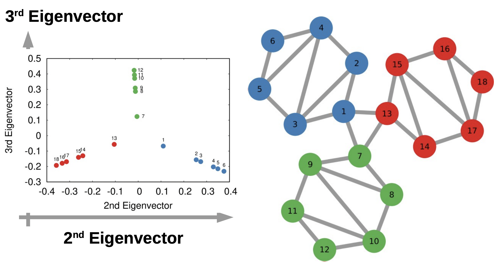

#### Table of contents

- [Adjacency Matrix](#51-adjacency-matrix)
- [Matrix Multiplication](#matrix-multiplication)
- [Stochastic Matrices](#stochastic-matrices)
- [Incidence Matrices](#incidence-matrices)
- [The Laplacian](#the-laplacian)
- [Paths & Walks](#7-paths--walks)
- [Notes from Lecture](#notes-from-lecture)

Readings: TAANS, Chapters 5, 7, & 8 (minus sections 5.4, 8.2, 8.3, 8.5)

## 5.1 Adjacency Matrix

We can represent multilayer networks with matrices. When you sum the row or the column of a adjacency matrix (of a undirected graph) you get the degree of the node.’

## Matrix multiplication

If you multiply the adjacency with itself transposed, you get the number if (2-step)paths between the nodes AND the number of common neighbours of those two nodes. $A^2$

The same with stochastic adjacency matrices, but with probabilities. What is the prob of going to this node with 2 steps. $SA^2$

$SA^3$ os the probability of going to this node with 3 steps.

### Tensors

A tensor is a generalised vector. A vector is a mono-dimensional array (only one row), while a matrix is a two-dimensional array, here a tensor is a multidimensional array. As many dimensions as we want. 

The first two dimensions are rows and columns, the next dimension is the layers. 

## Stochastic Matrices

The simplest makeover we can give to the adjacency matrix is to convert it into a stochastic matrix. This means that we normalise it, dividing each entry by the sum of its corresponding row – this means that each of its rows sums to one.

**Stochastic Adjacency** - what is the prob to go from any node to any other node in 1 step. A/A.sum(axis=1). You start from the normal adjacency matrix.

    

    

Converting an adjacency matrix into a stochastic matrix is normalising it (dividing each entry by the sum of its corresponding row, each of the rows sums to one). But what is the usefulness of these?

We can calculate transition probabilities. Each entry is the probability of a random walker on a given node (row) will cross that edge. In other words, it gives us the probability of all transitions for random walks of length 1.

## Incidence Matrices

Is a matrix telling you what are the relations between two classes of objects. In network analysis there are no type of incidence matrices that are widely used.

### Degree Matrix

Zeros everywhere in the matrix, and the $i$’th diagonal element is the degree of node $i$.

    

## The Laplacian

Then it comes to matrix representations, the Laplacian is very good. 

Subtracting the adjacency matrix from the degree matrix. $L = D-A$

The **Degree Matrix** is a diagonal matrix, and that is a matrix whose nonzero values are exclusively on the main diagonal. The Laplacian version of the adjacency matrix L = D - A. We take the Degree matrix D and subtract A from it. L is a matrix that has the node degree in the diagonal, -1 for each entry corresponding to an edge in the network, and 0 everywhere else. 

The operation producing the Laplacian matrix *L*
(c), subtracting the adjacency matrix *A* (b) from the degree matrix *D* (a).

Another connection between stochastic and Laplacian matrices is on multiplicity. The multiplicity of the smallest eigenvalue of the Laplacian plays the exact same role as the one of the largest eigenvalue of the stochastic matrix – a role that you will appreciate in Section 7.4 when we will study connected components.

# 7 Paths & Walks

**Walk** - Path with repeating nodes.

**Path** - A walk that does not repeat nodes or edges.

**Cycle** - is a path that begins and ends with the sam node.

It turns out that the number of eigenvalues equal to one is the number of components in the graph.

## Notes from lecture

### Stationary distributions

The stationary distribution tells us, if you have a path of infinite length, the probability of ending up on a destination is only dependent on the destinations location and not on your point of origin. 

Having a high value in the stationary distribution for a node means that you are likely to visit it often with a random walker – by the way, this is almost exactly what PageRank estimates, plus/minus some bells and whistles.

## Eigenvalue

There is n eigenvalues in a matrix of n rows. In a stochastic adjacency matrix the largest eigenvalue of the n eigenvalues, will always be 1.

If there is two eigenvalues that are equal to 1, there are two components in the network.

Each value of the eigenvector of a node tells you something about that node and the relationship to the rest of the structure. 

The largest eigenvector tells you which nodes are part of your component. If the values in the vector is zero, that node is not a part of that component.

**Eigenvalues and Laplacian**

Instead of putting the eigenvalues in decreasing order, we put then in increasing order. The smallest eigenvalue is always gonna be zero. Number of 0’s if = the number of components. 

The first non-zero eigenvalue of the order of eigenvalues tells you the solution to the problem called the normalised cut. (8.3 mincut problem)

    

It tells you which side of the cut the node is and how far away from the cut. 

## Eigenvectors

The third eigenvector of the order of the laplacian, tells you where you can cut the network to get 3 components instead of 2.

