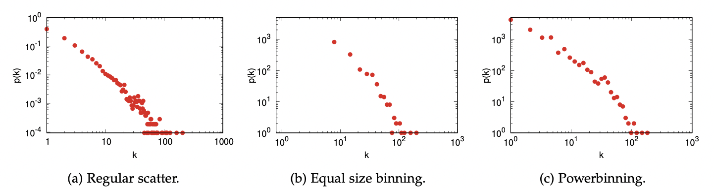
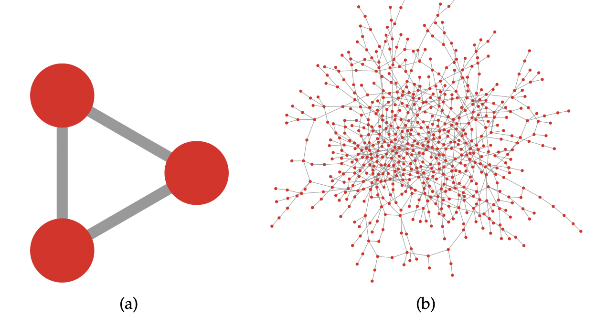
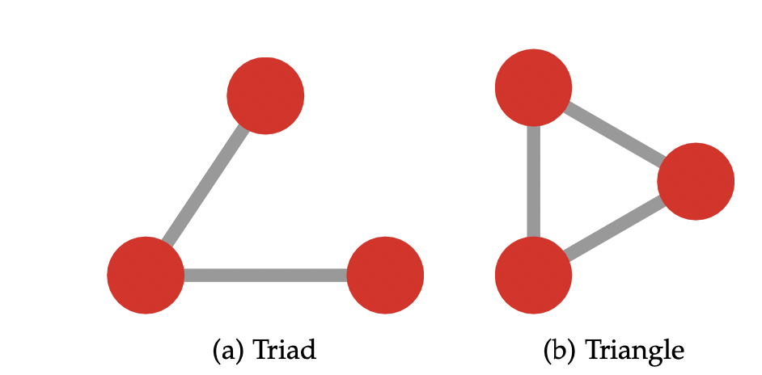
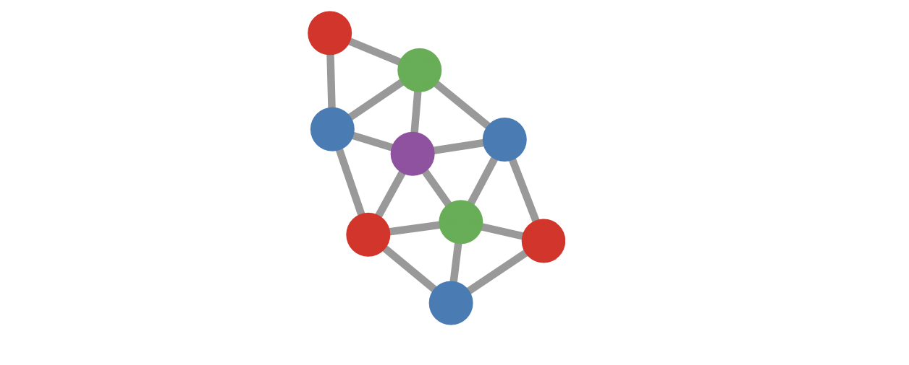
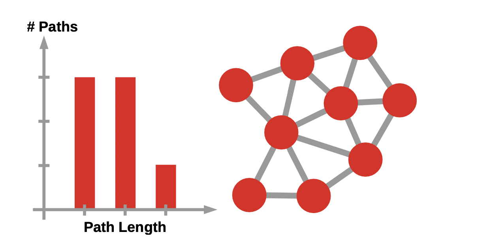
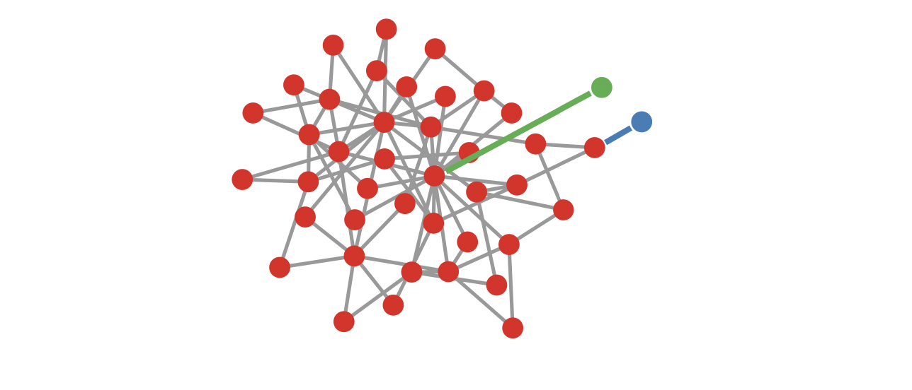

# Lecture 3

Readings: TAANS, Chapters 6, 9, 10 & 11 (minus sections 9.4, 10.5)
Subjects: Degree, Degree distr., Density, clustering, paths, basic metrics

# 6 Degree

**Node strength / weighted degree:** The total weight incident into a node. In a weighted directed graph, it is the total weight of the edges going into that specific node.

### Bipartite degree

There is a change in the matrix representations that is worthwhile to point out, when talking about degrees. 

Normally in a normal adjacency matrix (the binary one), the sum of the rows tell you the degree of the node. In a bipartite network, however, it will only tell you the degree of the $V_1$ nodes. 

You can fix this problem in 2 ways:

- Look at the column sums
- Look at the row sums of $A^T$

### Multigraph

Since we allow parallel edges, you can follow 2 distinct connections and end up in the same neighbour. Keep the number of neighbours and the degree (number of connections of a node) to them selves. $k_u \ne |N_u|$.

### Multilayer

Here there are some connection you shouldn’t count. Normally you wouldn’t count the interlayer coupling connections as part of the degree. Counting these connection wouldn’t give you any meaningful information. (since the connection wont lead you to a neighbour, but a different version of yourself, kinda).

**Versatility -** the ability of a node to be a relevant central node in different layers.

### Hypergraph

The degree in a hyper-graph is the number of hyper-edges to which a node belongs. Or, the number of its hyper-connections.

The number of neighbours has no relationship whatsoever with the number of connections. 

## 6.2 Degree Distributions

A degree distribution is a degree scatter plot, the degree on the x-axis and the number of nodes on the y-axis.

Commonly, one would normalise the y-axis by dividing its values by the number of nodes in the network, and the y-axis is the probability if a node to have a degree equal to $k$.

### How to generate and visualise a proper degree distribution

**Equal size binning:** 

For low degree values you’re putting together very populated bins, while for high degree values usually the distribution is so dispersed that you aren’t actually grouping together anything. So it doesn’t work ver well.

**Power-binning:**

You start with a small bin size, usually equal to 1. Then each bin becomes progressively larger, by a constant multiplicative factor. At first, the bins are still small. But, as you progress, the bins start to be large enough to group a significant portion of your space.

BUT you are forced to make a decision on the binning, and you can trick yourself into seeing a pattern that is not really there. 

**CCDF, the complement of a cumulative distribution function:**

We can transform a degree histogram into a CCDF by changing the meaning of the y-axis. Rather than being the probability of finding a node of degree equal to *k*, in a CCDF this is the probability of finding a node of degree *k* or higher. This is not a scattergram any more, but a function, which helps us when we need to fit it.

## Power laws and scale free networks

Many networks have a power law degree distribution, but rarely this is a pure power law: it is often shifted or truncated. Fitting a power law and finding the correct exponent is tricky and you should not do it using a linear regression: you should use specialised tools.

Moreover, determining whether the degree follows a power law is useful for modelling and theory, but it isn’t crucial empirically. The interesting thing is that networks have broad and unequal degree distributions. You can describe them with statistics that are easier to get right than the tricky business of fitting power laws.

$$
p(k) \sim k^{-\alpha}
$$

### Testing for the power law, in 2 ways

- Exponent of the power law, what is the power? To do this, calculating a linear fit for the log-log space, very good r2 and p-value (WRONG for determining whether it follows the power law or not)
- Does this network a power law in the distribution, do this log-likelihood, how likely is function f to fit data? Allows p-value estimation between two alternatives. (RIGHT)

Be aware of the lognormal and the power-law is very similar, and you can easily switch them around. 

### “almost” powerlaws

It is rare to see “pure” power law in real life networks. 

- Shifted power law, a power law excluding the head. “power law with a warm-up” (e.g facebook friends, you rarely see people with only 1 friend)      $p(k) \sim f(k)k^{-\alpha}$
- Exponential cutoff, a power-law excluding the tail, “truncated power law”, (there are not enough people on twitter fx)     $p(k) \sim k^{-\alpha} e^{-\lambda k}$

# 9. Density

Density is kinda the probability that a random node pair is connected. The number of edges that can exist, given the number of nodes. 

How many edges do we need to connect $|V|$ nodes?

In (a) the graph has 3 nodes. We would then expect $3 \cdot 2/2 = 3$ edges, and that is what we have. Its density is the maximum possible: 100%.

In graph (b) on the other hand, we have 650 nodes and 650 edges. $650 \cdot 649/2=210925$ edges, we would require for it to be 100% dense. But the density is only 0.31%. 

Real life network are far more sparse than this.

**General pattern:** The density of a network seems to go down as you increase the number of nodes. 

## 9.2 Clustering Coefficient

The clustering coefficient is a measure to distinguish between different cases of a network with the same number of nodes and the same density (they can look very different).

How many triads turn into triangles?

$$
CC=\frac{3 \cdot \text{\#Triangles}}{\text{\#Triads}}
$$

**OBS:** Do not confuse the clustering coefficient with the operation you already know as clustering. 

$$
\text{\# Triads }_v = \frac{n_v \cdot (n_v -1)}{2}
$$

Where $n_v$ is the number of neighbours of $v$.

The clustering coefficient is a number return that describes quantitatively how “clustered” a network looks. 

$$
CC = \frac{\sum_u A^3_{uu}}{\sum_{u \ne v} A^2_{uv}}
$$

So the Clustering Coefficient is 3 x #Triangles / #Triads.

Even though real life networks usually are really sparse, the clustering coefficient is larger than you would expect. 

This means that these systems might have few connections per node, but these connections tend to be clustered in the same neighbourhood.

Average clustering coefficient:

$$
CC=\frac{1}{|V|} \sum CC_v
$$

**OBS: There is a big difference in the average clustering coefficient and the global clustering coefficient!!**

## 9.3 Cliques

A network will contain many subsets of nodes where all possible edges is among the edges. This is called a clique.

## 9.4 Independent Sets

Anti-cliques, independent sets, is a set of nodes none of which are connected to each other. 

There is a big difference in the maximal and the maximum independent set.

**Maximal:**

A maximal independent set, just like a maximal clique, is an independent set to which you cannot add any node and still make it an independent set. The green set in the figure is maximal because the two green nodes are connected to all other nodes in the graph.

**Maximum:**

On the other hand, the maximum independent set is simply the largest possible independent set you can have in your network. In Figure 9.10, the red set is the maximum independent set, or at least one of the many possible independent sets of size 3. Finding the largest possible independent set is an interesting problem, because it tells you something about the connectivity of the graph

# 10. Shortest Paths

## 10.3 Path Length Distribution

Knowing the length distribution of all shortest paths in the network, conveys a lot of information about its connectivity. 

A tight distribution with little deviation implies that all nodes are more or less at the same distance from the average node in the network. A spread out distribution implies that some nodes are in a far out periphery and others are deeply embedded in a core.

### Diameter

The rightmost column of the histogram in the figure, we have the number of shortest paths of maximum length. This is the diameter of the network. The worst case for reachability in the network.

In real life data: Some researchers have found out that the diameter shrinks when nodes are added.

### Average

The average of all shortest path lengths. This is the expected length of the shortest path between two nodes picked random in the network.

$$
APL = \frac{\sum_{u,v \in V} |P_{uv}|}{|V|(|V|-1)}
$$

Where $P_{uv}$ is the path to go from $u$ to $v$ and $|P_{uv}|$ is its length. 

In real world networks, the average paths lengths (APL) are surprisingly short.

The most notorious enunciation of the surprising small average path length in large networks is the famous “six degrees of sepa- ration”. This concept says that, on average, you’re six handshakes away from meeting any person in the world, being a fisherman in Cambodia or an executive in Zimbabwe.

Other measures derived from the shortest path length distribution are:

- Eccentricity
- Radius of a network

### Minimum Spanning Tree

A minimum spanning tree is a tree connecting all nodes in the network which minimises the sum of edge weights.

# 11. Node Ranking

The degree of a node does not necessarily convey all information of the node importance, maybe the a node with a low degree is the key element of two large groups, and if you remove that specific node, the groups would be isolated?

Here are some measures for that.

## 11.1 Closeness

The closeness centrality of a node $v$, is all the shortest paths starting from that node to every possible destination in the network. Each of these paths has a length $(|P_{uv}|)$. We sum these lengths and average that value over the number of all possible destinations (which is the number of nodes in the network minus one).

It is the inverse average distance. How close am I on average to anybody?

$$
\text{Closeness Centrality} = \frac{(|V| -1)}{\sum_{u} |P_{uv}|}
$$

The closeness centrality of $v$ is nothing more than its inverse average path length, $1/APL_v$.

The advantage of closeness centrality is that it has a spatial intuition: the closer you are on average to anybody, the more central you are. Exactly like standing in the middle of a room makes you closer on average to each member of the crowd in a party than standing in a corner.

### The behaviour of closeness centrality compared to degree

How can two nodes with very low degree – for instance equal to one – have different closeness centrality values so that they end up distributing normally instead of on a skewed arrangement? One possible explanation is that edge creation is a lottery. The many nodes with degree equal to one that you have in broad degree distributions can get lucky with their choice of neighbour. Sometimes, like in the case of the green node in the figure below, the neighbour is a hub. The green node’s closeness centrality will then be high, because it is just one extra hop away from the hub itself – which is very central. Sometimes the new node will attach itself to the periphery – like the blue node in the figure below –, and thus have a very low closeness centrality.

## 11.2 Betweenness

Differently from closeness, with betweenness we are not counting distances, but paths. If we want to know the betweenness of node $v$, we count the number of paths passing through $v$ - but of which $v$ is neither an origin nor a destination.

The concept underlying betweenness centrality can be extended to go beyond nodes. You can use it to gauge the structural importance of edges. The definition is the same: the betweenness of an edge is the (normalised) count of shortest paths using the edge. If applied to connections, we call this measure “edge betweenness”.

The more shortest paths that passes through you, the more important you are.

## 11.3 Reach

Reach centrality is only defined for directed networks. The local
reach centrality of a node *v* is the fraction of nodes in a network that you can reach starting from $*v*$.

### HITS

HITS is another famous eigenvector centrality measure for directed networks, which divides nodes in two classes: hubs, who dominate out-degree centrality; and authorities, who dominate in-degree centrality.

### Harmonic Centrality

Harmonic centrality is a version of closeness centrality which solves the issue of networks with multiple connected components. In such networks, there are pairs of nodes that cannot reach each other, thus other approaches based on shortest paths and random walks wouldn’t work.